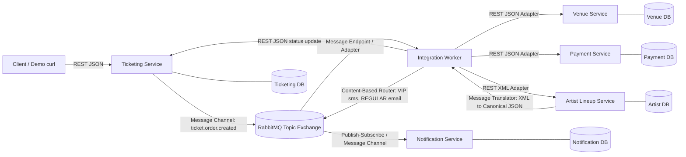

# Concert Organizer Integration

Proyek ini mensimulasikan integrasi enterprise untuk Concert Organizer: Ticketing, Venue, Artist/Lineup, Payment, dan Notification. Setiap sistem berjalan sebagai aplikasi mandiri dengan database sendiri, lalu dihubungkan lewat integration layer dan RabbitMQ.

## Sistem Yang Diintegrasikan

| Sistem | Port | Format utama | Database | Fungsi |
| --- | ---: | --- | --- | --- |
| Ticketing Service | 8001 | JSON/REST + event JSON | MongoDB volume `ticketing_mongo_data` | Membuat order tiket dan publish event |
| Venue Service | 8002 | JSON/REST | MongoDB volume `venue_mongo_data` | Reservasi kapasitas venue |
| Artist Lineup Service | 8003 | XML/REST dan JSON/REST | MongoDB volume `artist_mongo_data` | Menyediakan data lineup |
| Payment Service | 8004 | JSON/REST | MongoDB volume `payment_mongo_data` | Simulasi pembayaran |
| Notification Service | 8005 | JSON event consumer + REST | MongoDB volume `notification_mongo_data` | Menyimpan notifikasi peserta |
| Integration Worker | - | RabbitMQ + REST adapter | - | Orkestrasi order, router, dan translator |
| RabbitMQ | 5672 / 15672 | AMQP | Docker volume `rabbitmq_data` | Message broker tahan restart |

## Cara Menjalankan

```bash
cp .env.example .env
docker compose up --build
```

RabbitMQ Management UI:

- URL: http://localhost:15672
- User/password default: `guest` / `guest`

OpenAPI otomatis tersedia di:

- Ticketing: http://localhost:8001/docs
- Venue: http://localhost:8002/docs
- Artist: http://localhost:8003/docs
- Payment: http://localhost:8004/docs
- Notification: http://localhost:8005/docs

## Demo End-to-End

Buat order di Ticketing:

```bash
curl -X POST http://localhost:8001/orders \
  -H "Content-Type: application/json" \
  -d '{
    "concert_id": "concert-2026-jkt",
    "participant_name": "Rani Putri",
    "participant_email": "rani@example.com",
    "ticket_type": "VIP",
    "quantity": 2,
    "amount": "1500000",
    "currency": "IDR",
    "payment_method": "EWALLET"
  }'
```

Cek hasil integrasi:

```bash
curl http://localhost:8001/orders
curl http://localhost:8002/capacity/concert-2026-jkt
curl http://localhost:8004/payments
curl http://localhost:8005/notifications
```

Alur yang terjadi:

1. Ticketing membuat order `PENDING`.
2. Ticketing publish event `ticket.order.created` ke RabbitMQ.
3. Integration Worker consume event, lalu menjalankan proses lintas sistem.
4. Venue Service menerima reservasi kapasitas.
5. Payment Service membuat pembayaran.
6. Artist Service mengirim lineup dalam XML.
7. Integration Worker menerjemahkan XML lineup menjadi JSON internal.
8. Ticketing di-update menjadi `CONFIRMED`.
9. Notification Service menerima event notifikasi peserta.

## Diagram Arsitektur



## Enterprise Integration Patterns

| Pola | Implementasi |
| --- | --- |
| Message Channel | RabbitMQ exchange `concert.events` dan queue `integration.ticket-order`, `notification.participant` |
| Message Endpoint / Adapter | Integration Worker memakai REST adapter ke Venue, Payment, Artist, dan Ticketing |
| Message Translator | Artist mengirim XML, Integration Worker mengubahnya menjadi canonical JSON lineup |
| Content-Based Router | Notification channel dipilih dari tipe tiket: `VIP` ke `sms`, `REGULAR` ke `email` |
| Canonical Data Model | Event internal memakai envelope `event_id`, `event_type`, `occurred_at`, `source`, `data` |
| Dead Letter Channel | Queue memakai dead-letter exchange `concert.events.dlx` setelah retry habis |

## Skema Pesan Canonical

Envelope event internal:

```json
{
  "event_id": "uuid",
  "event_type": "TicketOrderCreated",
  "occurred_at": 1767229200,
  "source": "ticketing-service",
  "data": {}
}
```

Contoh event order:

```json
{
  "event_id": "b6d6bff0-39b0-4f7f-b134-e9d88aab1776",
  "event_type": "TicketOrderCreated",
  "occurred_at": 1767229200,
  "source": "ticketing-service",
  "data": {
    "order_id": "1d6250de-7391-4c30-890e-5b872ac3d7e5",
    "concert_id": "concert-2026-jkt",
    "customer": {
      "name": "Rani Putri",
      "email": "rani@example.com"
    },
    "ticket": {
      "type": "VIP",
      "quantity": 2
    },
    "payment": {
      "amount": "1500000",
      "currency": "IDR",
      "method": "EWALLET"
    }
  }
}
```

## Transformasi XML ke JSON

Sumber dari Artist Service:

```xml
<lineup concertId="concert-2026-jkt">
  <artist>
    <name>Nadin Amizah</name>
    <stage>Main Stage</stage>
    <startTime>19:00</startTime>
  </artist>
</lineup>
```

Hasil canonical internal:

```json
[
  {
    "name": "Nadin Amizah",
    "stage": "Main Stage",
    "start_time": "19:00"
  }
]
```

## Konfigurasi

Endpoint, queue, exchange, port, kredensial broker, dan alamat MongoDB diatur lewat environment variable di `.env` dan `docker-compose.yml`. Tidak ada service yang mengakses database service lain secara langsung.

## Reliable Messaging

Integration Worker menambahkan retry header `retry_count`. Jika proses gagal lebih dari `MAX_RETRIES`, pesan di-`nack` tanpa requeue sehingga masuk ke dead-letter exchange `concert.events.dlx`. Notification Service juga memakai `INSERT OR IGNORE` berbasis `event_id` untuk idempotency anti-duplikat.
